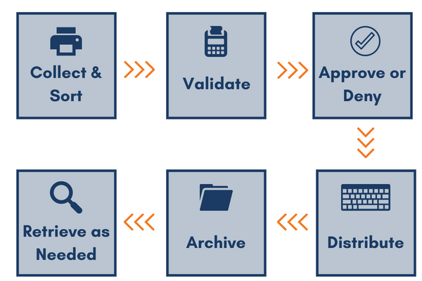

# EDMS-task

EDMS (https://en.wikipedia.org/wiki/Document_management_system) system is a system for managing documents within an organisation.

The purpose of this task is to create EDMS system for Azintelecom adhering to our business flow.

### How to start
Fork this repository to your account. Work on these tasks and then make a pull request when you finish. We will then evaluate your results. You can work in teams, however we will take into account each member\`s contribution.

## Backend

### Auth
- Login - the user can login (email and password) and receive JWT token that will be set on the browser.
- Logout - the user\`s token is erased from the browser.
- Me - return the information about the current user, name, email, permissions

### Roles
Roles (CRUD) - an endpoint that adds/retrieves/updates/deletes a role. Each role has a name and unique id.
Only admin user has access to roles.

### Users
Users (CRUD) - an endpoint that adds/retrieves/updates/deletes a user. Each user has a name, email, roles.
Only admin user has access to users.

### Categories
Categories (CRUD) - an endpoint that adds/retrieves/updates/deletes a category. Each category has a name and a parent category (optional if the root one).
Only admin user has access to categories.
Also, you can list the documents belonging to that category,

### Document types
Document types (CRUD) - an endpoint that adds/retrieves/updates/deletes a document type. Each type has a name.
Only admin user has access to document types.

### Document
Documents (CRUD) - an endpoint that adds/retrieves/updates/deletes a document. Each document has a name, a file, and a category it belongs to and document type.
Users with needed permissions can work with documents (AddDocument role, EditDocument role, ViewDocument role, DeleteDocument role).

### Workflow
Workflows (CRUD) - an endpoint that adds/retrieves/updates/deletes a workflow. Each workflow has a list of document types that go through that workflow.
Only admin user has access to workflows.

#### Workflow states
Each workflow can have a number of states (finite state machine):

Each state can have a name and unique id.
### Workflow actions
Each state can have a number of actions bound to it. For example, sign a document (using the user account), send email or approve. It should be easy to add new actions.
### Workflow transitions
Workflow moves between states through transitions. Workflow can have a number of transitions. Each transition can have a name, a source state and a target state.
When a state is finished (all the actions are executed), it moves to the next state using the transition. Transitions should be simple, meaning it cannot have a loop.
### Launch workflow
The workflows are launched when new documents of specific type are added to the system. For example, a new document for sick leave is added, with assigned document type SickLeave. It will then trigger a workflow to sign it for one person, then it will move to be signed by another person and finally approved by a third person.

There could any number of states with actions that required user\`s feedback.

## Databases

## Frontend
TODO: Requirements: Vue.Js, React

## Deployment

TODO: Requirements: Docker + Dockercompose
